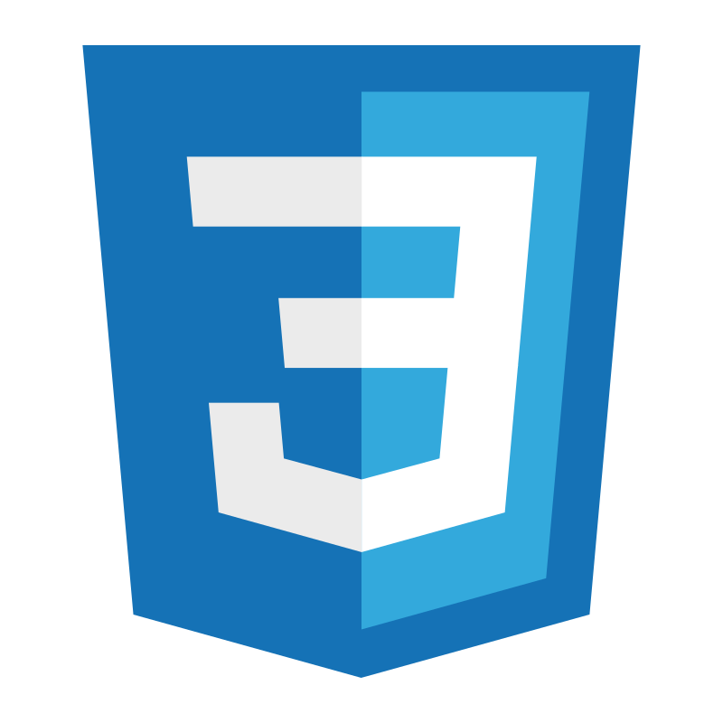
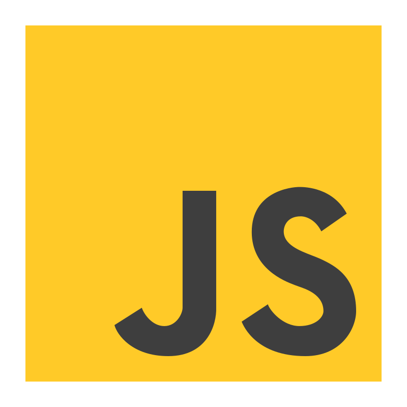

<h1 align="center">Hi there👋, I'm Aliakbar Murat</h1>
<h3 align="center">A third year student at Astana IT College</h3>

<h3 align="left">Languages and Tools:</h3>

 
   
   
   
   
   
   
   
   

